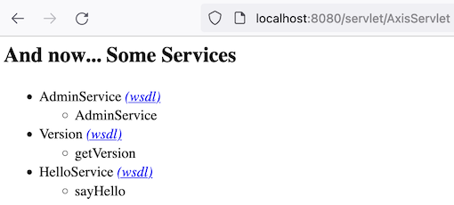

## SpringBoot2-Axis1.4

This is a SOAP Web Service project built by SpringBoot2 and Axis1.4.
It describes how to make both work together and demonstrates how to develop
our own SOAP Web Service.

#### Dependencies
Use `pom.xml` to introduce the same dependencies required by Axis 1.
Please see section of `<!-- Axis 1.4 -->` in `pom.xml` file.

#### SpringBoot JavaConfig
Translated Axis 1 [web.xml](https://github.com/apache/axis-axis1-java/blob/master/axis-war/src/main/webapp/WEB-INF/web.xml)
into SpringBoot Java Config. We can choose either `AppConfig` or `AppConfig1`.
If choose `AppConfig`, need to comment out `@Configuration` in `AppConfig1`, and vice versa.

#### Develop Web Service
Check `blog.yanbin.ws.HelloService`, just add a public method, like
```java
public String sayHello(String name) {
    return "Hello " + name;
}
```
Then add following lines into `server-config.wsdd` file
```xml
<service name="HelloService" provider="java:RPC">
  <parameter name="allowedMethods" value="*"/>
  <parameter name="scope" value="request"/>
  <parameter name="className" value="blog.yanbin.ws.HelloService"/>
</service>
```
***note: file `server-config.wsdd` is copied from 
[axis-axis1-java/axis-war/src/main/webapp/WEB-INF/server-config.wsdd](https://github.com/apache/axis-axis1-java/blob/master/axis-war/src/main/webapp/WEB-INF/server-config.wsdd)***

Restart Application - `Main` class, we'll the new added HelloService on 
page [AxisServlet](http://localhost:8080/servlet/AxisServlet)



#### Use AdminClient
Besides manually update `server-config.wsdd` file to deploy/undeploy a Web Service, 
we can leverage AdminClient and `deploy.wsdd/undeploy.wsdd` file to do the deployment.
Try `deploy.wsdd`, `undeploy.wsdd`, and `RunAdminClient` class to experience that.

#### Test Web Service
For the details, please try out `ServiceTest`. And with current `logback.xml` configuration,
we'll see the HTTP interaction -- request and response information.

#### Unsupported
1. Instance Web Service (*.jws) is not supported.

2. `/SOAPMonitor` is no longer supported since it's a JavaApplet which is deprecated/remove from newer JDKs.
